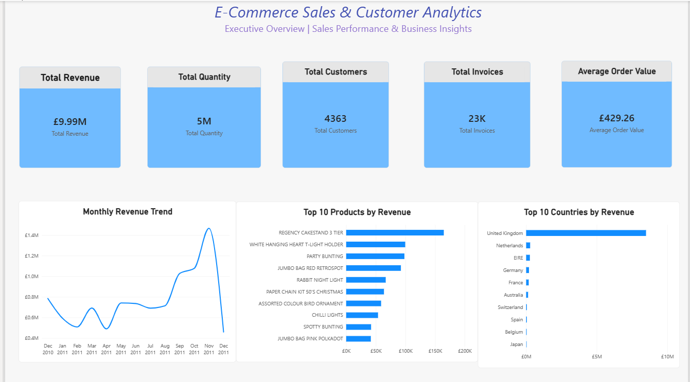
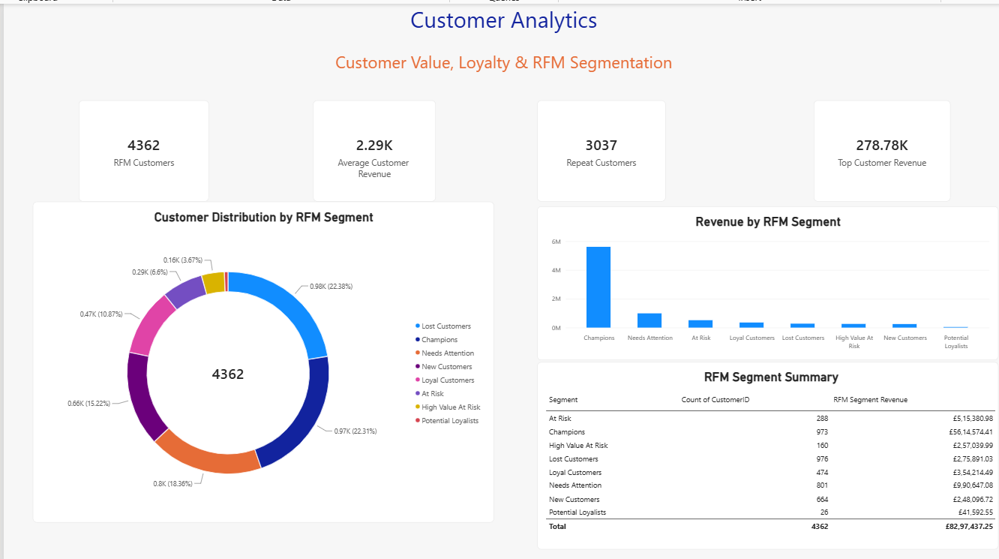
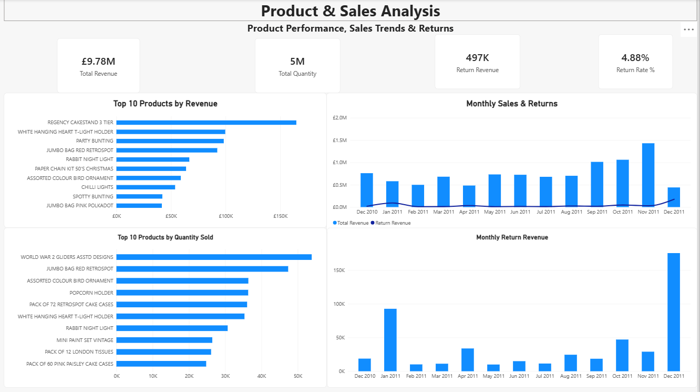
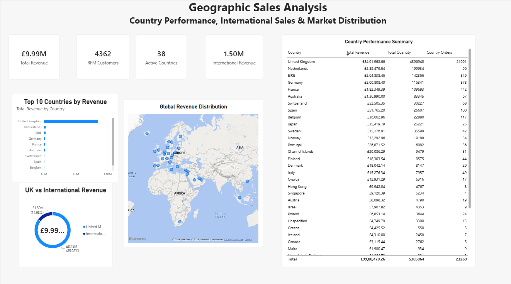
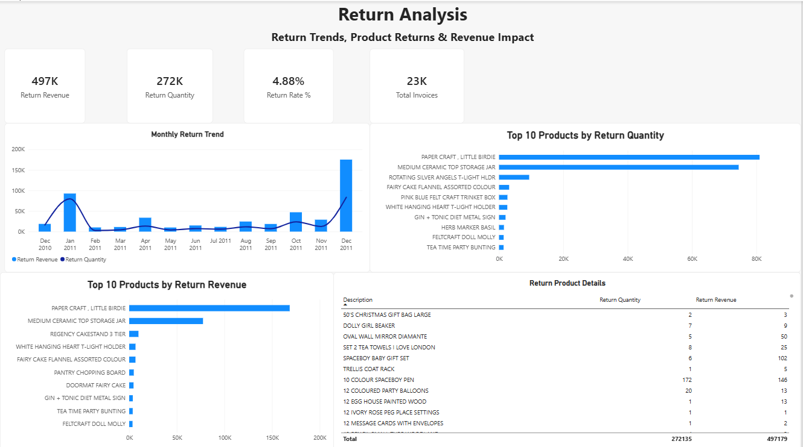

# E-Commerce Sales & Customer Analytics

An end-to-end data analytics project analyzing e-commerce sales, customer behavior, product performance, geographic sales, and returns using Python, SQL, and Power BI.

## 📊 Project Overview

This project analyzes the **UCI Online Retail Dataset**, containing transactional data from a UK-based online retailer.

The goal is to transform raw transactional data into meaningful business insights related to:

- Sales performance
- Customer value and loyalty
- RFM customer segmentation
- Product performance
- Geographic sales distribution
- Return behavior and revenue impact

## 🎯 Business Objectives

- Identify overall sales and revenue trends
- Find top-performing products
- Analyze customer purchasing behavior
- Segment customers using RFM analysis
- Identify important international markets
- Analyze product returns and their revenue impact
- Build an interactive Power BI dashboard for business decision-making

## 🗂️ Dataset

**Dataset:** UCI Online Retail Dataset

The dataset contains **541,909 raw transaction records** with the following fields:

- Invoice Number
- Stock Code
- Product Description
- Quantity
- Invoice Date
- Unit Price
- Customer ID
- Country

The dataset covers transactions from **December 2010 to December 2011**.

## 🛠️ Tools & Technologies

- Python
- Pandas
- Jupyter Notebook
- SQL
- Power BI
- DAX
- Excel

## 🔄 Data Cleaning & Preparation

The raw dataset was cleaned and prepared using Python.

Key steps included:

- Removed duplicate transactions
- Classified sales and returns
- Created a Revenue column
- Removed non-product transactions
- Removed records with missing product descriptions
- Removed zero-price transactions
- Separated product sales from discount transactions
- Created customer-level RFM analysis
- Created monthly sales and return summaries
- Prepared country-level datasets
- Prepared product-level datasets

## 📈 Power BI Dashboard

The final Power BI report contains five analytical pages.

### 1. Executive Overview

Provides a high-level view of:

- Total Revenue
- Total Quantity
- Total Customers
- Total Invoices
- Average Order Value
- Monthly Revenue Trend
- Top 10 Products by Revenue
- Top 10 Countries by Revenue

### 2. Customer Analytics

Analyzes:

- Customer Count
- Average Customer Revenue
- Repeat Customers
- Top Customer Revenue
- RFM Customer Segmentation
- Revenue by RFM Segment
- Customer Distribution

### 3. Product & Sales Analysis

Analyzes:

- Top 10 Products by Revenue
- Top 10 Products by Quantity
- Monthly Sales & Returns
- Monthly Return Revenue
- Product-level sales performance

### 4. Geographic Sales Analysis

Analyzes:

- Revenue by Country
- Top 10 Countries
- Global Revenue Distribution
- UK vs International Revenue
- Country-level sales performance

### 5. Returns Analysis

Analyzes:

- Return Revenue
- Return Quantity
- Return Rate
- Monthly Return Trends
- Top Products by Return Quantity
- Top Products by Return Revenue
- Detailed Product Return Performance

## 📸 Dashboard Preview

### Executive Overview



### Customer Analytics



### Product & Sales Analysis



### Geographic Sales Analysis



### Returns Analysis



## 💡 Key Insights

- Total analyzed revenue was approximately **£9.97M** across **23K+ invoices**.
- The **United Kingdom** generated the majority of total revenue, making it the dominant market.
- **Champions** represented the most valuable RFM customer segment and contributed approximately **67.7% of known-customer revenue**.
- The top customer generated approximately **£278.8K** in revenue.
- Revenue increased significantly during the later months of 2011, with **November 2011** recording the highest full-month revenue.
- Returns generated approximately **£497K** in return revenue, representing a return rate of approximately **4.9%**.
- International markets provided an important secondary source of revenue, led by the **Netherlands, EIRE, Germany, and France**.
- Product-level analysis highlights a small group of products that contribute significantly to overall revenue and return activity.

## 📁 Project Structure

```text
Ecommerce-Sales-Customer-Analytics/
│
├── data/
│   ├── Online Retail.xlsx
│   └── processed/
│       ├── country_summary.csv
│       ├── customer_rfm.csv
│       ├── monthly_returns.csv
│       ├── monthly_revenue.csv
│       └── product_summary.csv
│
├── python/
│   └── 01_data_understanding.ipynb
│
├── SQL/
│   └── sales_analysis.sql
│
├── powerbi/
│   └── Ecommerce_Sales_Customer_Analytics.pbix
│
├── Screenshots/
│   ├── page1-executive-overview.png
│   ├── page2-customer-analytics.png
│   ├── page3-product-sales.png
│   ├── page4-geography-analysis.png
│   └── page5-return-analysis.png
│
└── README.md
